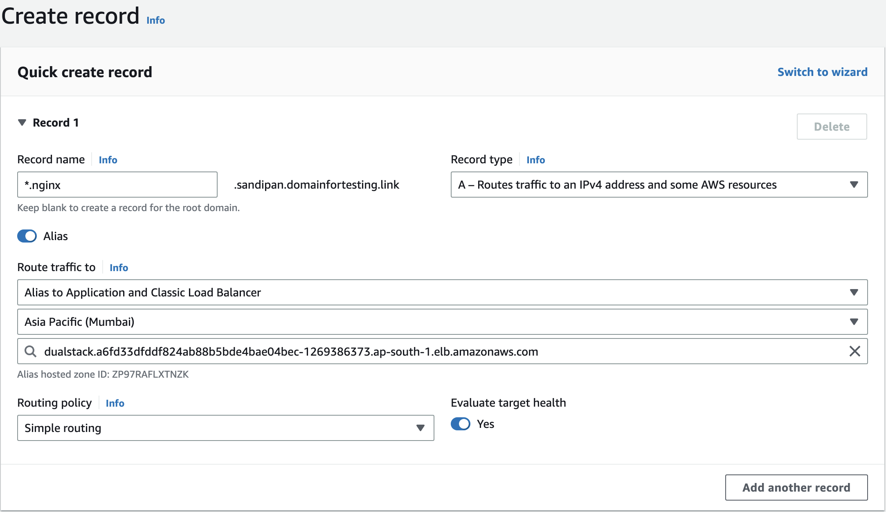

# Virtual Service - Subdomain POC

This POC is to understand the routing of traffic based on subdomains.

## Application Setup

- Two different versions of nginx pods in default namespace
  - SSH into the pods and change the html content for difference of pods.
- One service for each nginx pod

## AWS Setup
- Create a hosted zone for a domain in Route 53
- Create an Alias or a CNAME record with the load balancer url for a subdomain.


```
Note: Config your domain with name servers of Route 53
```
## Istio Setup

- One gateway
- One virtual service for each subdomain

## Requirement

To route traffic based on the subdomain of the request.

- When a request is made to `v1.nginx.<domain name>`, then the call must be routed to v1 of nginx.
- When a request is made to `v2.nginx.<domain name>`, then the call must be routed to v2 of nginx.

## POC Insights

- Gateway allows all the traffic matching the following pattern

`*.nginx.sandipan.domainfortesting.link`

- Each virtual service allows only the traffic from the subdomain defined in the host

`v1.nginx.sandipan.domainfortesting.link`
`v2.nginx.sandipan.domainfortesting.link`

